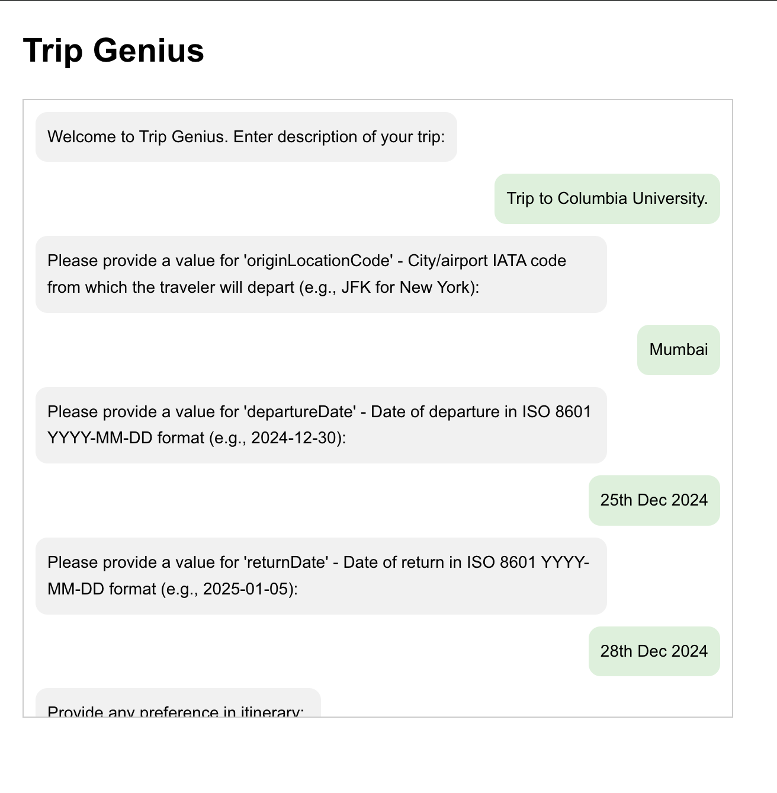
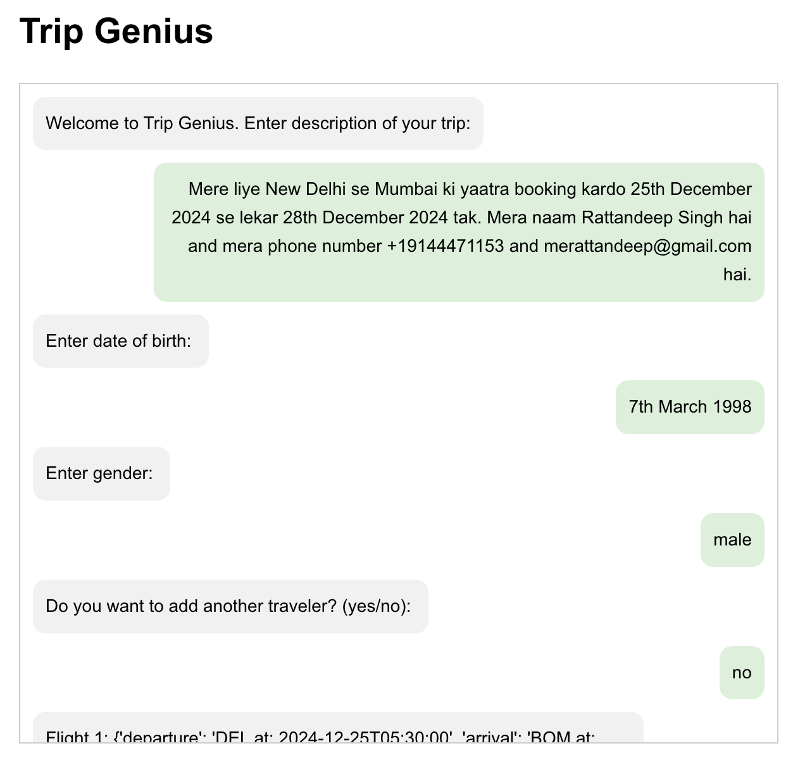
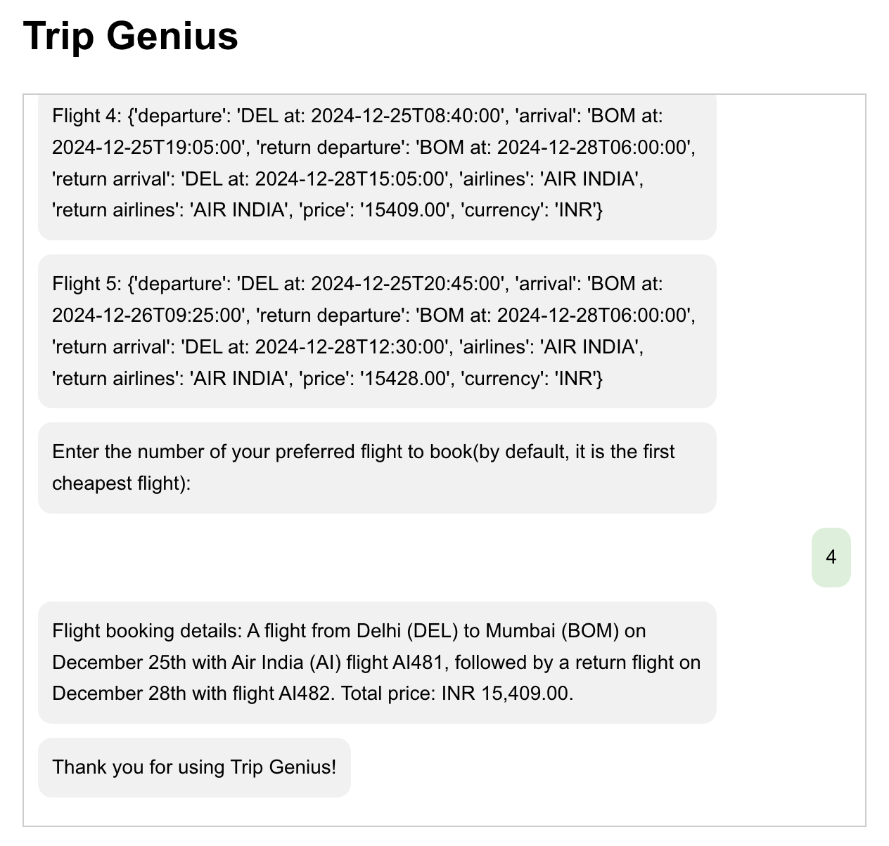
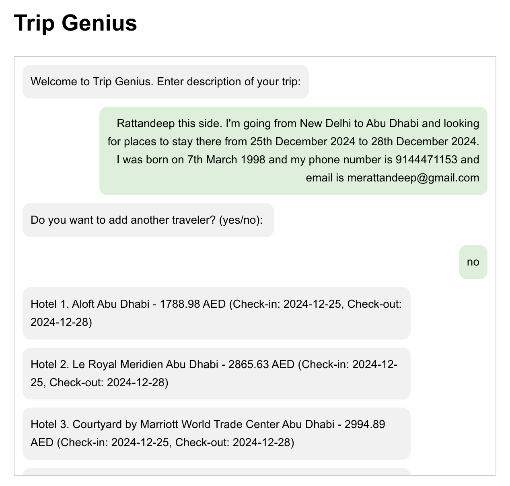
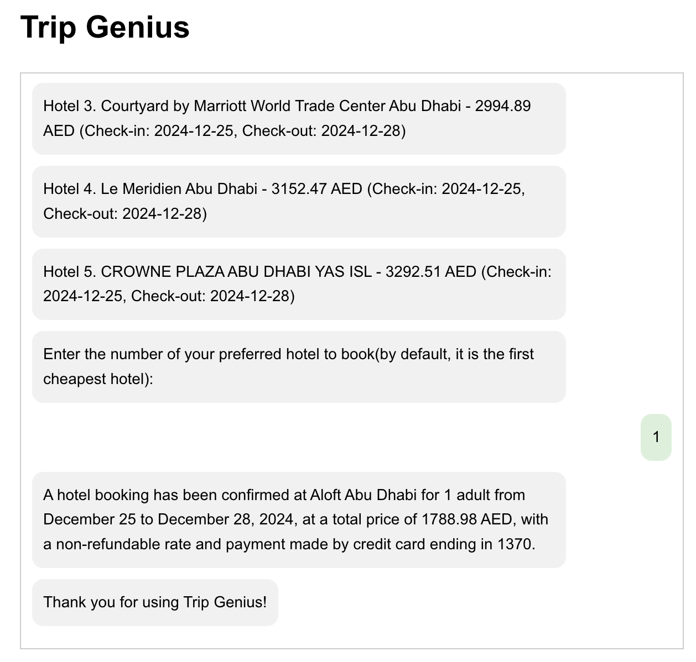

# Trip Genius
An intelligent and simple solution for trip planning and booking

## Introduction
Trip Genius is an AI-based travel planning and booking application designed to simplify trip planning by integrating flights, hotels, and itineraries into a unified platform. Using Large Language Models (LLMs) and real-time API interactions, Trip Genius automates end-to-end trip planning and booking, offering personalized recommendations based on user preferences.

## Methodology and Architecture

### Modular Agent-Based Architecture

The Modular Agent-Based Architecture in Trip Genius is designed to break down the travel planning process into independent, specialized components or "agents." This approach ensures flexibility, maintainability, and scalability by allowing each agent to handle a specific aspect of travel booking. The architecture follows a divide-and-conquer strategy, making the system easier to debug, test, and extend.

The architecture uses the LangChain framework to build these modular tools, facilitating seamless integration of language models (LLMs) with real-world APIs. Each tool is responsible for handling a particular type of user request:

1. FlightBooking Tool
2. HotelBooking Tool
3. ItinerarySuggestions Tool

These tools are automatically invoked based on the user's intent, detected using LLMs.

### Tools Overview

#### FlightBooking Tool

The FlightBooking Tool handles the booking of flights based on user preferences, such as origin, destination, dates, and number of travelers.

Key Features:
- Interacts with the Amadeus API to fetch real-time flight offers.
- Extracts user details like names, birthdates, and contact information.
- Presents multiple flight options and allows the user to choose the preferred one.
- Handles booking confirmation and error reporting.

#### HotelBooking Tool

The HotelBooking Tool handles hotel bookings by querying the Amadeus API for available accommodations in a specified destination and date range.

Key Features:
- Searches for hotels based on destination and check-in/check-out dates.
- Allows the user to choose from a list of available hotels.
- Manages booking confirmations with traveler details.
- Includes error handling for API failures and missing data.

#### ItinerarySuggestion Tool

The ItinerarySuggestions Tool creates optimized travel itineraries based on user preferences and destination details.

Key Features:
- Uses clustering (K-Means) and graph algorithms (TSP) to optimize the sequence of attractions.
- Suggests top restaurants, tourist attractions, and activities.
- Integrates data from APIs like Amadeus, Google Places and TripAdvisor.
- Generates day-by-day travel plans with detailed recommendations.

### How Tools are Triggered Based on User Intent

Trip Genius uses a two-step process to determine and trigger the appropriate tool based on user input:

#### Intent Detection:

User inputs are processed by an LLM-based Intent Classification Model. The model classifies the intent into one of the following categories:

- "book flights": Triggers the FlightBookingTool.
- "book hotels": Triggers the HotelBookingTool.
- "get itinerary": Triggers the ItinerarySuggestionTool.
- "book a trip": Triggers all three tools in sequence.

#### Dynamic Tool Invocation:

Based on the detected intent, the corresponding tool is invoked. The tools interact with the user to gather additional details if necessary and then proceed with booking or itinerary generation.

### Additional Features

#### Function Calling Framework
The Function Calling Framework in Trip Genius leverages OpenAI's function-calling capabilities and the LangChain framework to convert user inputs into structured API calls. This allows the system to:

- Automatically identify the parameters required for API calls.
- Convert natural language queries into JSON payloads suitable for APIs.
- Dynamically invoke the appropriate tool (FlightBooking, HotelBooking, or ItinerarySuggestions) based on user intent.

#### Multilingual Support
Trip Genius supports multiple languages, making it accessible to a diverse user base. The system can:
- Understand user queries in various languages (e.g., English, Hindi, French).
- Generate booking confirmations, itineraries, and error messages in the user's preferred language.
- Utilize language models like GPT-3.5-turbo for multilingual understanding and generation.

#### Error Handling and Fallback Mechanisms
Trip Genius incorporates robust error handling and fallback mechanisms to ensure service continuity even when issues arise:
- API Failures: Handles cases where the Amadeus API is down or returns an error.
- Missing Data: Asks the user for missing parameters if essential details are not provided.
- Fallback Strategies:
  - Cached Data: Uses previously stored data if live API calls fail.
  - Alternative APIs: Switches to alternative data sources when the primary API is unavailable.
- User-Friendly Messages: Provides clear and actionable error messages.

The Modular Agent-Based Architecture in Trip Genius, combined with the Function Calling Framework, Multilingual Support, and Error Handling Mechanisms, creates a robust, scalable, and user-friendly travel planning platform. This modular design allows for seamless integration of new features and ensures a smooth experience for users, even in the face of unexpected issues.

## Code Structure

1. `app` folder contains the entire application logic and backend code for Trip Genius.
2. `data` folder contains the data and data generation scripts
3. `scripts` folder contains other automated testing and load test scripts.
4. `ui` folder contains the frontend of Trip Genius built using react.

## Backend and Frontend Code

### Backend

The backend for Trip Genius is built using FastAPI, a modern Python web framework optimized for high performance and asynchronous communication. It exposes two endpoints to handle the booking process, supports interactive user sessions, and utilizes the constructor pattern for maintaining and managing state in an asynchronous environment.

#### Endpoints:
1. POST `/initiate_bookings`: Starts a new booking session based on the user query.
2. POST `/continue_booking`: Allows users to continue an existing session by sending further inputs to the booking flow.

#### Asynchronous Communication:
The backend utilizes Python generators to handle interactive communication between the system and the user in a step-by-step manner.
The constructor pattern ensures reusability of the booking logic without blocking the main application thread.

#### State Management:
A session dictionary (SESSIONS) tracks ongoing booking workflows using unique session IDs (uuid).

#### CORS Middleware:
Cross-Origin Resource Sharing (CORS) is enabled to allow the frontend (React) running on localhost:3000 to interact with the FastAPI backend.

### Frontend

1. React: A robust library for building dynamic and responsive UI components.
2. State Management: React useState ensures smooth handling of session data and user inputs.
3. API Communication: Axios is used to send POST requests to the FastAPI backend and retrieve responses.
4. CORS Middleware: Ensures the frontend can interact seamlessly with the backend running on a different port.

## Experiment Results

The experiments were conducted to evaluate the accuracy, performance, and robustness of the Trip Genius system. The evaluations focused on the following metrics: synthetic data generation, entity extraction, intent matching, latency, and system reliability. All results were obtained using GPT-3.5-turbo as the underlying language model for processing user inputs, intent classification, and generating API requests.

### Synthetic Data Generation
To ensure a comprehensive evaluation, synthetic data was generated to simulate various real-world travel scenarios. These scenarios included different user queries with diverse parameters such as origins, destinations, travel dates, preferences, and the number of travelers. Edge cases were also covered to validate the system's ability to handle ambiguous, incomplete, or unusual inputs.

#### Result:
- Generated 50+ unique scenarios that cover all possible edge cases, including:
- Multiple travelers with varying details.
Complex itinerary queries (e.g., multi-city trips).
- Partial inputs requiring additional clarification.

### Entity Extraction Accuracy
Entity extraction evaluates the system's ability to identify key parameters from user input, such as:
- Origin and destination cities.
- Travel dates (departure and return).
- Number of travelers.
- User-specific preferences (e.g., budget, trip type).

Entity extraction is critical as it ensures the parameters fed into APIs are accurate and complete.

#### Result
Achieved 94.37% accuracy for entity extraction using GPT-3.5-turbo.
This high accuracy ensures minimal errors during API requests and significantly improves booking success rates.

### Intent Matching Accuracy
Intent matching assesses the system's ability to classify user queries into one of the following categories:
- "book flights"
- "book hotels"
- "get itinerary"
- "book a trip"

Accurate intent detection is essential for triggering the correct tools (e.g., FlightBookingTool, HotelBookingTool, or ItinerarySuggestionsTool).

#### Result
Achieved 98.50% accuracy in intent matching using GPT-3.5-turbo.
The system reliably triggers the appropriate tool based on user input, ensuring a seamless booking workflow.

### Performance Measurement
Performance was measured based on the time taken to complete a full end-to-end interaction, including:

- Entity extraction.
- Intent classification.
- API calls to fetch and display flight, hotel, or itinerary options.
- User interactions for clarifications and confirmations.

#### Result
- Average execution time: 23.17 seconds for completing a booking flow.
- The system optimizes performance by minimizing redundant API calls and prefetching data where applicable.

### Count of LLM and API Calls
The system's efficiency was evaluated by analyzing the total number of LLM calls and API calls made during a typical user session. LLM calls include operations like intent detection and parameter extraction, while API calls include fetching flight, hotel, and itinerary data.

#### Result
- Average count of calls:
  - 8 LLM Calls: For entity extraction, intent classification, and confirmations.
  - 5 API Calls: For retrieving flight options, hotel offers, or itineraries.
- This demonstrates that the system is optimized to minimize resource usage while maintaining high accuracy and performance.

### Tracing Requests
System reliability and latency were measured using LangSmith to ensure a smooth user experience. Key metrics include:
- Error Rate: The percentage of failed requests.
- TP99 Latency: The time taken to respond to 99% of requests, which highlights system responsiveness under peak loads.

#### Result
- Error Rate: 0% (no failed requests).
- TP99 Latency: 4.85 seconds, indicating that 99% of all user queries were processed within 4.85 seconds, even under load.

## Tutorial

[This](./TUTORIAL.md) tutorial provides step-by-step instructions for installing, configuring, and running the **Trip Genius** application. The setup covers both the backend (built using FastAPI) and the frontend (built using React), ensuring a seamless execution of the project.

## Usage Example and Demonstrations

This section provides **screen recordings** and **screenshots** showcasing the functionality of **Trip Genius** across various travel scenarios. The examples cover **flight booking**, **hotel booking**, **itinerary suggestion**, and complex cases like **trip planning with multiple travelers**.

### **1. Screen Recordings**

Below are the links to screen recordings demonstrating the core features of Trip Genius:

1. **Flight Booking**  
   Demonstrates the process of booking flights based on user input, including origin, destination, and travel dates.  [Flight Booking Demo](https://drive.google.com/file/d/1mVElPWFZzlyjt2UvGjuHZX3DJKLRXfYi/view?usp=drive_link)

2. **Hotel Booking**  
   Walkthrough of the hotel booking process, including choosing check-in/check-out dates and selecting available accommodations. [Hotel Booking Demo](https://drive.google.com/file/d/1D7uofEGbm-E-Wb7LrfIJxG3CTjnx3ZNu/view?usp=drive_link)

3. **Itinerary Suggestion**  
   Demonstrates the generation of an optimized day-by-day travel itinerary based on user preferences and destinations. [Itinerary Suggestion Demo](https://drive.google.com/file/d/19okRnMH9Lx3yOtSAkHHRViXVZcPErobv/view?usp=drive_link)

4. **Entire Trip Planning**  
   Covers an end-to-end trip planning workflow, including flights, hotels, and itinerary suggestions. [End-to-End Trip Planning Demo](https://drive.google.com/file/d/1BHoQKYs_hnYayvV0dkiEt2MhAg-EqKkt/view?usp=drive_link)

5. **Trip Planning with Multiple Travelers**  
   Shows how the system handles trip planning for multiple travelers, including extracting details and preferences. [Multiple Travelers Demo](https://drive.google.com/file/d/165kDuDlN2CEFdB1q_rHir3Vt1OxUmVzG/view?usp=drive_link)

### **2. Screenshots of Interesting Scenarios**

Below are key screenshots highlighting interesting use cases and edge cases handled by Trip Genius:

1. **Automatic Detection of Destination**  
The system automatically detects the destination city and country from an incomplete query. In this case, destination is detected as New York.  

2. **Multilingual Support**  
Demonstrates handling user input in Hindi for booking a trip.  

3. **Booking Hotels Without Explicit Mention**  
The system identifies intent to book hotels even when not explicitly stated.  

The above examples demonstrate how **Trip Genius** provides a seamless and intelligent solution for travel planning. From booking flights and hotels to generating optimized itineraries, the application offers a robust and user-friendly experience for individual and multi-traveler scenarios.

For a hands-on demonstration, refer to the **screen recordings** and explore the various features of Trip Genius in action.

## Summary

**Trip Genius** is an AI-powered travel planning and booking platform that simplifies the process of organizing trips by integrating flights, hotels, and itineraries into a unified system. Built with a modular agent-based architecture using the **LangChain framework** and powered by **GPT-3.5-turbo**, it intelligently handles user queries through real-time API interactions and function-calling capabilities. The backend, developed using **FastAPI**, supports asynchronous communication and exposes endpoints for initiating and continuing bookings, while the frontend, built with **React**, provides an interactive user experience. With multilingual support, robust error handling, and fallback mechanisms, the platform ensures reliability and accessibility for a diverse user base. Extensive experiments demonstrate **94.37% entity extraction accuracy**, **98.50% intent matching accuracy**, an average execution time of **23.17 seconds**, and a **0% error rate** with a TP99 latency of **4.85 seconds**. Trip Genius offers a seamless, automated, and user-friendly solution for planning and booking stress-free travel experiences.